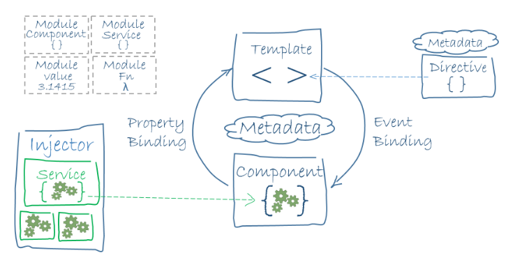
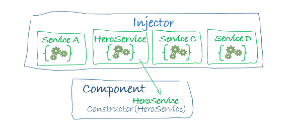

# Jornada 3: Comenzando con Angular 2: Componentes, módulos e inyectables.

Repasar temas pendientes de jornadas anteriores en especial decoradores.
Recordar que hay dos Pdfs en la carpeta "resources". 

## Plan de trabajo:

El objetivo de esta jornada es dar una primera vista de la arquitectura. Centrarnos en Modules, Components e Injectors. Vamos a hacer varias sesiones de trabajo para, *partiendo del proyecto mini-demo*, crear y usar esos elementos.

Angular es Open Source y aquí tenemos el código:

https://github.com/angular/angular

## Arquitectura

https://angular.io/docs/ts/latest/guide/architecture.html



En esencia:

You write Angular applications by composing HTML templates with Angularized markup, writing component classes to manage those templates, adding application logic in services, and boxing components and services in modules.

Then you launch the app by bootstrapping the root module. Angular takes over, presenting your application content in a browser and responding to user interactions according to the instructions you've provided.

Como vemos en la imagen anterior tenemos los siguientes elementos:

* Modules
* Components
* Templates
* Metadata
* Data binding
* Directives
* Services
* Dependency injection

### Modules

Every Angular app has at least one module, the root module, conventionally named AppModule.

An Angular module, whether a root or feature, is a class with an @NgModule decorator.

Ejemplo:

```typescript
import { NgModule }      from '@angular/core';
import { BrowserModule } from '@angular/platform-browser';

import { AppComponent }  from './app.component';

@NgModule({
  imports: [ BrowserModule ],
  declarations: [ AppComponent ],
  bootstrap:    [ AppComponent ]
})
export class AppModule { }
```

* NgModule is a decorator function that takes a single metadata object whose properties describe the module. The most important properties are:

    * *declarations* - the view classes that belong to this module. Angular has three kinds of view classes: components, directives, and pipes.
    * *exports* - the subset of declarations that should be visible and usable in the component templates of other modules.
    * *imports* - other modules whose exported classes are needed by component templates declared in this module.
    * *providers* - creators of services that this module contributes to the global collection of services; they become accessible in all parts of the app.
    * *bootstrap* - the main application view, called the root component, that hosts all other app views. Only the root module should set this bootstrap property. (Solo para el mainmodule).

*BrowserModule* registers critical application service providers. It also includes common directives like NgIf and NgFor which become immediately visible and usable in any of this modules component templates.

Los módulos son elementos de agrupación y estructuración de elementos y son una pieza clave a la hora de establecer nuestra estrategía de carga de la aplicación.

_Sesión de trabajo: Crear un nuevo módulo en el proyecto de ejemplo_

Hay dos tipos de módulos:

1. root modules.
2. feature module.

Los módulos Angular no son exactamente módulos JavaScript. Se identifican con el decorador *@ngModule*.

### Components

Es un elemento visual, es una vista. Es algo muy similar a un webcomponent en cierta forma.

Así lo definen el equipo de Angular 2:

> "A component controls a patch of screen real estate that we could call a view, and declares reusable UI building blocks for an application."

Ejemplo:

```typescript
import {Component} from '@angular/core';

@Component({
    selector: 'hello',
    template: '<p>Hello, {{name}}</p>'
})

export class Hello {
    name: string;
    constructor() {
        this.name = 'World';
    }
}
```

Posibles configuraciones para un @Component:

* *moduleId*: sets the source of the base address (module.id) for module-relative URLs such as the templateUrl.
* *selector*: CSS selector that tells Angular to create and insert an instance of this component where it finds a *hero-list* tag in parent HTML. For example, if an app's HTML contains *hero-list**/hero-list*, then Angular inserts an instance of the HeroListComponent view between those tags.
* *templateUrl*: module-relative address of this component's HTML template, shown above.
* *providers*: array of dependency injection providers for services that the component requires. This is one way to tell Angular that the component's constructor requires a HeroService so it can get the list of heroes to display.

### Templates

Es un trozo de HTML que le dice a Angular como pintar el componente.

```html
<h2>Hero List</h2>
<p><i>Pick a hero from the list</i></p>
<ul>
  <li *ngFor="let hero of heroes" (click)="selectHero(hero)">
    {{hero.name}}
  </li>
</ul>
<hero-detail *ngIf="selectedHero" [hero]="selectedHero"></hero-detail>
```

No es un simple HTML ya que contiene su propia sintaxis. También puede contener elementos de otros controladores, ejemplo: *hero-detail*.

### Metadata

Los metadatos le dicen a Angular 2 cómo procesar una clase. Como hemos visto hasta ahora, todos los elementos son clases, pero se pueden inicializar y cambiar su comportamiento usando decoradores.

```typescript
@Component({
  moduleId: module.id,
  selector:    'hero-list',
  templateUrl: 'hero-list.component.html',
  providers:  [ HeroService ]
})
export class HeroListComponent implements OnInit {
/* . . . */
}
```

El decorador @Component le dice a Angular toda la información que necesita para crea y presentar el componente y su vista. 

* @Injectable, @Input, and @Output are a few of the more popular decorators.

### Data binding

Angular supports data binding, a mechanism for coordinating parts of a template with parts of a component. Add binding markup to the template HTML to tell Angular how to connect both sides.


Ejemplo:

```html
<li>{{hero.name}}</li>
<hero-detail [hero]="selectedHero"></hero-detail>
<li (click)="selectHero(hero)"></li>
```

* The *{{hero.name}}* interpolation displays the component's hero.name property value within the *li* tags.
* The *[hero]* property binding passes the value of selectedHero from the parent HeroListComponent to the hero property of the child HeroDetailComponent.
* The *(click)* event binding calls the component's selectHero method when the user clicks a hero's name.

Two-way data binding is an important fourth form that combines property and event binding in a single notation, using the ngModel directive. Here's an example from the HeroDetailComponent template:

```html
<input [(ngModel)]="hero.name">
```

### Directivas

A directive is a class with directive metadata. In TypeScript, apply the @Directive decorator to attach metadata to the class.
A component is a directive-with-a-template; a @Component decorator is actually a @Directive decorator extended with template-oriented features.
While a component is technically a directive, components are so distinctive and central to Angular applications that this architectural overview separates components from directives.

Hay dos tipos de directivas:

1. structural. Structural directives alter layout by adding, removing, and replacing elements in DOM.

```html
<li *ngFor="let hero of heroes"></li>
<hero-detail *ngIf="selectedHero"></hero-detail>
```

 *ngFor y *ngIf son directivas.

2. attribute. Attribute directives alter the appearance or behavior of an existing element. In templates they look like regular HTML attributes, hence the name.

```html
<input [(ngModel)]="hero.name">
```

Angular has a few more directives that either alter the layout structure (for example, *ngSwitch*) or modify aspects of DOM elements and components (for example, *ngStyle* and *ngClass*).

Nosotros podemos crear nuestras propias directivas.

### Services

Son clases que hacen algo en nuestra aplicación.

Ejemplos:

* logging service
* data service
* message bus
* tax calculator
* application configuration

### Dependency injection

Dependency injection is a way to supply a new instance of a class with the fully-formed dependencies it requires. Most dependencies are services. Angular uses dependency injection to provide new components with the services they need.



When Angular creates a component, it first asks an injector for the services that the component requires.

```typescript
import { Injectable } from '@angular/core';
import { HEROES }     from './mock-heroes';

@Injectable()
export class HeroService {
  getHeroes() { return HEROES;  }
}

//The component Code.

import { Component }          from '@angular/core';
import { HeroService }        from './hero.service';

@Component({
  selector: 'my-heroes',
  providers: [HeroService],
  template: `
  <h2>Heroes</h2>
  <hero-list></hero-list>
  `
})
export class HeroesComponent { }
```

## Módulos

Documentación de referencia: https://angular.io/docs/ts/latest/guide/ngmodule.html

Un Modulo Abgular 2 es un mecanismo de agrupación de elementos: componentes, directivas, pipes, servicios, etc que están relacionados entre si y que pueden ser utilizados en otros elementos de la aplicación.

Podría decirse que los módulos son clases que definen métodos públicos y privados.

```typescript
import { NgModule } from '@angular/core';

@NgModule({
  imports: [ ... ],
  declarations: [ ... ],
  bootstrap: [ ... ]
})
export class AppModule { }
```

_Revisar los comentado en la parte de arquitéctura._

Existen dos tipos de módulos:

1. root
2. feature

Es importante recordar que el *root*, es único en la aplicación y que siempre deberemos importar *BrowserModule*, pero en el caso de los módulos de tipo *feature* no deberemos de importar BrowserModule, pero si es obligatorio importar *CommonModule*. Si vamos a usar LazyLoading importar *BrowserModule* podría darnos problemas.

Puesto el que módulo root es obligartorio este es la entrada a la aplacación, es el *main* de toda la aplicación y es necesario cargarlo de un modo especial, si no lo hiciesemos nuestra aplicación no arrancaría. Esta carga del *AppModule* se demonina *Boostrapping* y se realiza de la siguiente manera:

```typescript
import { platformBrowserDynamic } from '@angular/platform-browser-dynamic';
import { AppModule } from './app/app.module';

platformBrowserDynamic().bootstrapModule(AppModule);
```

Hemos usado *platformBrowserDynamic* porque estamos cargando nuestra apliación en un navegador, pero el Boostrapping va a depender de la plataforma en la que estemos cargando nuestra aplicación, en el caso de que nuestra aplicación se ejecute en node la llamada será otra.
Y en el caso de que estemos usando AOT (Ahead of Time) usaremos *platformBrowser*.

Un módulo vácio no sirve de nadam, ya que al ser elementos de agrupación su principal beneficio se produce cuando cargamos el módulo con elementos propios: components, pipes, directivas, servicios, etc.

Vamos a crear un component:

```typescript
import { Component, OnInit } from '@angular/core';
import { CreditCardService } from './credit-card.service';

@Component({
  selector: 'rio-credit-card',
  template: `
      <p>Your credit card is: {{ creditCardNumber | creditCardMask }}</p>
  `
  })
  export class CreditCardComponent implements OnInit {
    creditCardNumber: string;
    constructor(private creditCardService: CreditCardService) {}
    ngOnInit() {
      this.creditCardNumber = this.creditCardService.getCreditCard();
    }
}
```

que a su vez utiliza un servicio:

```typescript
import { Injectable } from '@angular/core';

@Injectable()
export class CreditCardService {
  getCreditCard(): string {
    return '2131313133123174098';
  }
}
```

además tiene una pipe:

```typescript
import { Pipe, PipeTransform } from '@angular/core';
@Pipe({
  name: 'creditCardMask'
})
export class CreditCardMaskPipe implements PipeTransform {
  transform(plainCreditCard: string): string {
    const visibleDigits = 4;
    let maskedSection = plainCreditCard.slice(0, -visibleDigits);
    let visibleSection = plainCreditCard.slice(-visibleDigits);
    return maskedSection.replace(/./g, '*') + visibleSection;
  }
}
```

Ahora tenemos que declararlo al módulo que los contiene:

```typescript
import { NgModule } from '@angular/core';
import { BrowserModule } from '@angular/platform-browser';
import { AppComponent } from './app.component';
import { CreditCardMaskPipe } from './credit-card-mask.pipe';
import { CreditCardService } from './credit-card.service';
import { CreditCardComponent } from './credit-card.component';
@NgModule({
  imports: [BrowserModule],
  providers: [CreditCardService],
  declarations: [
    AppComponent,
    CreditCardMaskPipe,
    CreditCardComponent
  ],
  bootstrap: [AppComponent]
})
export class AppModule { }
```

Ahora con "to' el muñeco montao'" ya podemos usarlo en el root component:

```typescript
import { Component } from "@angular/core";
@Component({
  selector: 'rio-app',
  template: `
    <h1>My Angular 2 App</h1>
    <rio-credit-card></rio-credit-card>
    `
})
export class AppComponent {}
```

*Cuidado con la forma como hemos definido el servicio en la propiedad *providers*, esto solo lo debemos hacer así en el root module. Podemos tener problemas en el lazy loading de los feature modules.

Ahora vamos a echar un ojo a los feature modules:

No podemos tener solo un módulo root que contenga toda la lógica de nuestra aplicación, porqué: _discutir razones_

Por eso vamos a reorganizar nuestro código de forma que facilite la claridad y la reutilización:

```
.
├── app
│ ├── app.component.ts
│ └── app.module.ts
├── credit-card
│ ├── credit-card-mask.pipe.ts
│ ├── credit-card.component.ts
│ ├── credit-card.module.ts
│ └── credit-card.service.ts
├── index.html
└── main.ts
```

Casi todo el código anterior nos vale, pero primero tenemos que crear el módulo:

```typescript
import { NgModule } from '@angular/core';
import { CommonModule } from '@angular/common';
import { CreditCardMaskPipe } from './credit-card-mask.pipe';
import { CreditCardService } from './credit-card.service';
import { CreditCardComponent } from './credit-card.component';

@NgModule({
  imports: [CommonModule],
  declarations: [
    CreditCardMaskPipe,
    CreditCardComponent
  ],
  providers: [CreditCardService],
  exports: [CreditCardComponent]
})
export class CreditCardModule {}
```

Es casi igual salvo dos diferencias:

1. No hemos importado *BrowserModule*, hemos importado *CommonModule*, esto entre otras cosas hace que nuestro código sea utilizable en otras plataformas.
2. Hemos usado una nueva propiedad *exports*. Todos los elementos en el Array *declarations* son por defecto provados. Solo podemos exportar lo que esté explicitamente indicado en la propieda *exports*. 

Claro, también tenemos que cambiar el módulo desde el que se vaya a consumir los elementos de este módulo, en nuestro caso el appModule:

```typescript
import { NgModule } from '@angular/core';
import { BrowserModule } from '@angular/platform-browser';
import { CreditCardModule } from '../credit-card/credit-card.module';
import { AppComponent } from './app.component';

@NgModule({
  imports: [
    BrowserModule,
    CreditCardModule
  ],
  declarations: [AppComponent],
  bootstrap: [AppComponent]
})

export class AppModule { }
```

Lazy loading:

Llegados a este punto tenemos que aclarar que: los componentes, pipes y dirctivas pertenecen al módulo y no se pueden usar salvo ue sean explicitamente exportados. Además, los servicios con visibles y utilizables globalmente a menos que se realice una una carga lazy del módulo. (Esto tiene que ver con que los servicios son singletons, ya veremos mas sobre servicios mas adelante). 

Cuando un módulo es cargado de forma Lazy angular entonces creará un inyector hijo y generará ña instancia del servicio.

Si realizasemos una carga lazy del módulo *CreditCardModule* tal y como lo hemos definido anteriormente, sin cambiar nada, después de la carga del módulo tendríamos dos instancias del "singleton" y eso podría tener muchos problemas. Veremos mas detalles más adelante, cuando veamos el Lazy Loading.

Pero en nuestro caso podríamos hacer lo siguiente:

```typescript
import { NgModule, ModuleWithProviders } from '@angular/core';
/* ...other imports... */
@NgModule({
  imports: [CommonModule],
  declarations: [
    CreditCardMaskPipe,
    CreditCardComponent
  ],
  exports: [CreditCardComponent]
})
export class CreditCardModule {
  static forRoot(): ModuleWithProviders {
    return {
      ngModule: CreditCardModule,
      providers: [CreditCardService]
  }
}
}
```

que comparado con lo anterior:

```typescript
import { NgModule } from '@angular/core';
import { CommonModule } from '@angular/common';
import { CreditCardMaskPipe } from './credit-card-mask.pipe';
import { CreditCardService } from './credit-card.service';
import { CreditCardComponent } from './credit-card.component';

@NgModule({
  imports: [CommonModule],
  declarations: [
    CreditCardMaskPipe,
    CreditCardComponent
  ],
  providers: [CreditCardService],
  exports: [CreditCardComponent]
})
export class CreditCardModule {}
```
podemos ver que no hemos expuesto *providers* directamente, sino a través de la función estática *forRoot*

pero claro, también tenemos que cambiar la forma como importamos el módulo:

```typescript
/* ...imports... */
@NgModule({
  imports: [
    BrowserModule,
    CreditCardModule.forRoot()
  ],
  declarations: [AppComponent],
  bootstrap: [AppComponent]
})
export class AppModule { }
```

La documentación indica que siempre se use *forRoot* para exportar servicios desde módulos *feature* a menos que queramos tener varias instancias a diferentes niveles de inyección de dependencia.

No hemos terminado con los módulos, ya que tenemos que ver mas detalles cuando veamos el Lazy loading mas adelante.

_Taller crear un nuevo módulo y usarlo dentro de nuestra aplicación_

## Components:

Un componente es algoq que es visible por el usuario final y que puede ser reutilizado varias veces dentro de la apliación.

Vamos a echar un ojo a un componente sencillo:

```typescript
import {Component} from '@angular/core';
@Component({
  selector: 'hello',
  template: '<p>Hello, {{name}}</p>'
})
export class Hello {
  name: string;
  constructor() {
    this.name = 'World';
  }
}
```

Los componentes pueden estar anidados y ser utilizados unos dentro de otros:

```html
<TodoApp>
  <TodoList>
    <TodoItem></TodoItem>
    <TodoItem></TodoItem>
    <TodoItem></TodoItem>
  </TodoList>
  <TodoForm></TodoForm>
</TodoApp>
```

Paso de datos a un componente:

Realamente el componete crea una API que permite explotar las posibilidades del componente, para ello crea una serie de propiedades y métodos de clase que pueden ser invocados y consumidos por los elementos que usan dichos componentes. Tanto de forma declarativa como programática:

```typescript
import {Component, Input} from '@angular/core';
@Component({
  selector: 'hello',
  template: '<p>Hello, {{name}}</p>'
})
export class Hello {
  @Input() name: string;
}
``` 

En este caso *@Input() name: string;* define un parametro que puede ser pasado desde el componente padre.

```html
<!-- To bind to a raw string -->
<hello name="World"></hello>
<!-- To bind to a variable in the parent scope -->
<hello [name]="name"></hello>
```

Por otro lado también podemos indicar que eventos va a disparar nuestro componente. En general vamos a usar el siguiente mecanismo de comunicación entre le padre y el componente:

* El padre se comunica con el componente mediante propiedades.
* El componente se comunica con el padre mediante eventos.

Vemos que también tenemos otra forma de comunicarnos que permite una comunicación bidireccional. Lo veremos más adelante.

Supongamos que queremos notificar al componente padre que se ha pulsado el botón dentro de nuestro componente, podemos hacer algo así:

```typescript
import {Component, EventEmitter, Input, Output} from '@angular/core';
@Component({
  selector: 'counter',
  template: `
    <div>
    <p>Count: {{ count }}</p>
    <button (click)="increment()">Increment</button>
    </div>
  `
})
export class Counter {
  @Input() count: number = 0;
  @Output() result: EventEmitter = new EventEmitter();

  increment() {
    this.count++;
    this.result.emit(this.count);
  }

}
``` 

y lo consumiriamos de esta forma:

```typescript
import {Component} from '@angular/core';

@Component({
  selector: 'app',
  template: `
    <div>
      Parent Num: {{ num }}<br />
      Parent Count: {{ parentCount }}
	    <counter [count]="num" (result)="onChange($event)">
	    </counter>
	  </div>
  `
})
export class App {
  num: number;
  parentCount: number;
  
  constructor() {
    this.num = 0;
    this.parentcount = 0;
  }
  
  onChange(val: any) {
    this.parentCount = val;
  }
}
```

Los componentes también soportan *Projection* mediante la directiva *ngContent*:

```typescript
import {Component} from '@angular/core';

@Component({
	selector: 'child',
	template: `
	  <div style="border: 2px solid blue; padding: 1rem; margin: 2px;">
	    <h4>Child Component</h4>
	    <ng-content></ng-content>
    </div>
	`
})
export class Child {
  childCount: number = 24;
}

// Lo usariamos de la siguiente forma:

import {Component} from '@angular/core';

@Component({
	selector: 'app',
	template: `
    <div style="border: 2px solid black; padding: 1rem;">
      <h4>App Component</h4>
	    <child>
	      <p>My <i>projected</i> content.</p>
	      <p>
	        <b>Count:</b> {{ count }} <br/>
	        <b>Child Count:</b> {{ childCount || 'N/A' }}
	     </p>
	    </child>	    
	  </div>
	`
})
export class App {
  count: number = 12;
}
```


Accessing Child Component Classes
@ViewChild & @ViewChildren
@ContentChild & @ContentChildren

### Ciclo de vida de un componente:

* ngOnChanges - called when an input binding value changes
* ngOnInit - after the first ngOnChanges
* ngDoCheck - after every run of change detection
* ngAfterContentInit - after component content initialized
* ngAfterContentChecked - after every check of component content
* ngAfterViewInit - after component's view(s) are initialized
* ngAfterViewChecked - after every check of a component's view(s)
* ngOnDestroy - just before the component is destroyed

Component	Description

| Hook | Description
| OnChanges	| See how Angular calls the ngOnChanges hook with a changes object every time one of the component input properties changes. Shows how to interpret the changes object.
| DoCheck | Implements an ngDoCheck method with custom change detection. See how often Angular calls this hook and watch it post changes to a log.

AfterView	
Shows what Angular means by a view. Demonstrates the ngAfterViewInit and ngAfterViewChecked hooks.

AfterContent	
Shows how to project external content into a component and how to distinguish projected content from a component's view children. Demonstrates the ngAfterContentInit and ngAfterContentChecked hooks.

Counter	
Demonstrates a combination of a component and a directive each with its own hooks.

In this example, a CounterComponent logs a change (via ngOnChanges) every time the parent component increments its input counter property. Meanwhile, the SpyDirective from the previous example is applied to the CounterComponent log where it watches log entries being created and destroyed.


Información de base: 

https://angular.io/docs/ts/latest/guide/lifecycle-hooks.html
https://angular.io/docs/ts/latest/api/core/index/Component-decorator.html
https://angular.io/docs/ts/latest/tutorial/toh-pt3.html
https://angular.io/docs/ts/latest/cookbook/component-communication.html

## Inyectables:

https://angular.io/docs/ts/latest/guide/dependency-injection.html
https://angular.io/docs/ts/latest/guide/hierarchical-dependency-injection.html
