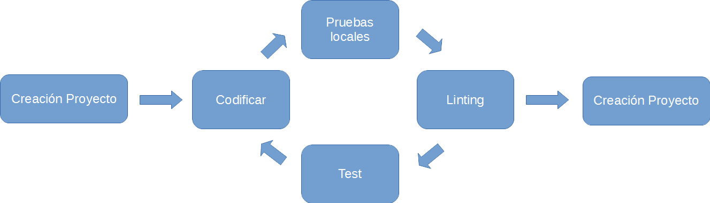

# IDEs para Angular 2.

En este documento vamos a repasar las necesidades de entornos de desarrollo propias de Angular 2. También repaseremos las opciones de editores de texto e IDEs más completos para la programación de aplicaciones Angular 2.  

## ¿Por qué un IDE?

Definimos un IDE (Integrated development environment) como una herramienta de desarrollo de software. Un IDE, normalmente, consta de; un editor de código fuente, herramientas de autocompletado e inspección de código, una herramienta de construcción de la aplicación y herramientas para el depurado.

Hasta ahora el desarrollo de aplicaciones Web con JavaScript se ha caracterizado por la ligereza en las herramientas de desarrollo, no siendo necesario mas que un editor de texto y una consola.

Pero, con las cada vez mas complejas herramientas de desarrollo, la incorporación de más tareas en el proceso de desarrollo, en el test y el despliege de las aplicaciones, por no hablar de nuevos lenguajes de programación como TypeScript hacen que el desarrollo de las aplicaciones Web cada vez se apróximen mas a los ciclos de vida y necesidades de otro tipo de aplicaciones y lenguajes como Java o C#. Es por eso que cada vez son mas necesarios entornos integrados que nos faciliten todo el proceso o ciclo de vida de creación de apliaciones Web.

### ¿Qué aporta un IDE con respecto a un editor de texto?

Un IDE va mas allá de un simple editor de texto aportando: 

* Un autocompletado y resaldado de colores del código (intellisence) que tenga en cuenta los elementos del lenguaje y el contexto de los elementos.
* Inspección del código en tiempo de escritura.
* Herramientas de automatización de tareas, especialmente la construcción de la aplicación y testing dentro del propio IDE.
* Herramientas de depuración integradas dentro del propio IDE.
* Una buena integración con las herramientas de gestión de versiones; git, cvs, mercurial, etc.

### Editores de texto reconvertidos en IDEs

Algunas de las herramientas mas populares en el desarrollo web no comenzaron como IDEs, se tratan de editores de texto que mediante la adición de plugins o addins permiten comportarse o dar la funcionalidad que le pediriamos a un IDE. 
Debido al peso, el grado de funcionalidad que aportan y la popularidad de los mismos, los incluimos en este análisis. 

## ¿Qué requisitos mínimos deberíamos de pedir a un IDE?

Que cumpla con el flujo de vida completo del desarrollo Web al mayor grado posible:

### Necesidades especiales de Angular 2.

Angular 2 es un framework que tiene las siguientes particularidades con respecto a una programación solo en JavaScript con otros frameworks y librerias:

* Permite ser programado en TypeScript y Dart. Lenguajes fuertemente tipados y bien estructurados que facilitan la creación de un buen intellisence y un buen control de errores mientras se escribe el código.
* Requiere de una serie de tareas de construcción y empaquetado complejas.
* Permite ejecutarse en servidor. Lo que implica que debería de ser posible ser depurado desde el propio IDE.

## Lista de IDEs recomendados:

* ALM
* Atom
* Brackets
* Eclipse
* Sublime Text
* Visual Studio Code
* WebStorm

### Tabla de IDEs, versiones y plataformas.

IDE | Licencia | Plataformas
--- | --- | ---
ALM | Open Source | Linux, Mac y Windows (Necesita node y Chrome)
Atom | Open Source | Linux, Mac y Windows
Brackets | Open Source | Linux, Mac y Windows
Eclipse | Open Source | Linux, Mac y Windows
Sublime Text | Privada | Linux, Mac y Windows
Visual Studio Code | Open Source | Linux, Mac y Windows
WebStorm | Privada | Windows, Mac y Linux

#### Fortalezas y debilidades

#### ALM

Web: http://alm.tools/

Este editor presenta algunas novedades de enfoque muy interesantes y novedosas. De entrada cuando lo arrancamos lo que iniciamos es un servidor de aplicación con un puerto local. Para arrancar el editor tenemos que llamar a la URL (http://localhost:4444) desde Chrome. Este es muy útil cuando queremos instalar el editor como un servicio en algún proveedor de servicios de forma que siempre podamos acceder a nuestro entorno desde cualquier ordenador.

Fortalezas | Debilidades |
--- | --- |
Entorno completo y preconfigurado para TypeScript Fácil instalación con npm Posibilidad de instalarlo en Cloud | Rendimiento algo pobre Puede que resulte un poco complejo al principio No soporta plugins |

#### Atom

Web: https://atom.io/

Fortalezas | Debilidades |
--- | --- |
Muy buen editor de código Fácilmente extensible mediante plugins Ligero | No es un IDE, es un editor de texto Es necesario instalar plugins para dar soporte a TypeScript |

#### Brackets

Web: http://brackets.io/

Fortalezas | Debilidades |
--- | --- |
Buen soporte a la inspección de código e intellisense Ligero Fácilmente extensible mediante plugins | No es un IDE, es un editor de texto Es necesario instalar plugins para dar soporte a TypeScript |

#### Eclipse

Web: http://www.eclipse.org/downloads/packages/eclipse-ide-javascript-web-developers/indigosr2
Algunos plugins: http://typecsdev.com/

Fortalezas | Debilidades |
--- | --- |
Uno de los IDEs más potentes Fácilmente extensible mediante plugins Para alguien que venga del mundo Java es un entorno familiar Los plugins son muy potentes y lo convierten en un IDE muy potente |  esado y lento Es necesario instalar plugins para dar soporte a TypeScript |

#### Sublime Text

Web: https://www.sublimetext.com/

Fortalezas | Debilidades |
--- | --- |
Ligero Fácilmente extensible mediante plugins | No es un IDE, es un editor de texto Es necesario instalar plugins para dar soporte a TypeScript Requiere licencia |

#### Visual Studio Code

Web: http://www.eclipse.org/downloads/packages/eclipse-ide-javascript-web-developers/indigosr2

Es el IDE de Microsoft que también es el creador de TypeScript 

Fortalezas | Debilidades |
--- | --- |
Es un IDE y tiene todo lo que se le puede pedir a un IDE Fácilmente extensible mediante plugins Ligero Depuración integrada Intellisense y refractor de código integrado | Un poco básico en lo que no es TypeScript Necesidad de instalar algunos plugins para hacerlo mas productivo No se puede ver dos carpetas en la misma ventana

#### WebStorm

Web: https://www.jetbrains.com/webstorm/

Fortalezas | Debilidades |
--- | --- |
Es un IDE y tiene todo lo que se le puede pedir a un IDE Fácilmente extensible mediante plugins Ligero Depuración integrada Intellisense y refractor de código integrado | Es necesario comprar licencia

#### Tabla comparativa

Parámetros de comparación:

1. Asistencia al desarrollo. Autocompletado, marcado del código fuente. Indicación de errores.
2. Tareas integradas. Build, Linting, Watch, etc.
3. Depuración. Posibilidad de depuración de código cuando se trate de código que no se ejecute en un navegador (nodejs).
4. Rendimiento. Consumo de recursos del equipo y velocidad de funcionamiento.

IDE | Asistencia al desarrollo | Tareas integradas | Depuración | Rendimiento
--- | --- | --- | --- | ---
ALM |  |  |  | 
Atom |  |  |  | 
Brackets |  |  |  | 
Eclipse |  |  |  | 
Sublime Text |  |  |  | 
Visual Studio Code |  |  |  | 
WebStorm |  |  |  | 

## Conclusiones

Ciertamente todas las herramientas consideradas son excelentes elecciones como herramientas de desarrollo y, más allá de las preferencias personales, los IDEs más completos desde cero, sin la necesidad de incluir plugins son; *WebStorm* y *Visual Studio Code*. Destacando el primero por funcionalidad.
En otro orden están los editores que permiten mediante plugins obtener un grado de confor y productividad muy bueno. En este caso destacan *Brackets* (con entrada propia en el Blog de John Papa indicando su configuración personal) por su bueno soporte de intellisense y *ALM* por el bueno soporte que trae de fábrica y la posibilidad de instalarlo en Cloud. 