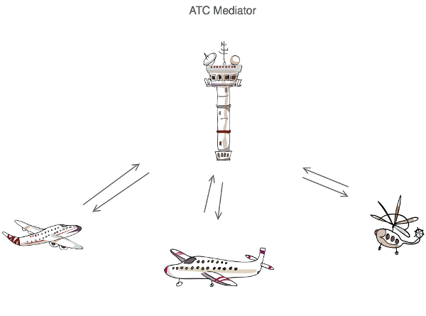

# Directivas estructurales en polymer y comunicación entre componentes.

## Plan de trabajo

En esta jornada vamos a profundizar en conceptos que están relacionados con la creación de componentes y que no en la jornada anterior no se pudieron ver en profundidad.
Después repasaremos las diferentes directivas estructurales que se corresponde con el apartado "API Reference" de la documentación oficial.
Y para finalizar veremos las opciones de comunicación entre componentes y la comunicación de componentes con otros elementos.

## Data System

Polymer permite observar cambios en las propiedades de un elemento y tomar varias acciones basadas en cambios de datos. Estas acciones, o efectos de propiedad, incluyen:

https://www.polymer-project.org/1.0/docs/devguide/data-system

## Propiedades (Computed)

https://www.polymer-project.org/1.0/docs/devguide/properties

## Observers

https://www.polymer-project.org/1.0/docs/devguide/observers

## Data binding

https://www.polymer-project.org/1.0/docs/devguide/data-binding

## Comunicación entre componentes

Una de los pilares fundamentales de los Web componentes es la indepencia y el aislamiento de cada uno de los elementos. Por eso no se debe crear acoplamientos entre componentes. Por eso debemos recurrir a patrones y mecanismos que nos permitan propagar los diferentes mensajes generados por cada componente formalizar los mecanismos de interacción de los elementos que consumen dichos componentes.

El patrón que mas se asemeja a lo que queremos representar es el patrón Mediador:



Como vemos en el ejemplo, ninguno de los aviones conoce la existencia del resto, interactúan con el mediador, en este caso la torre de control. 

Este es nuestro patrón de interacción:

(Propiedades) Consumidor => Polymer web component
Polymer web component => Consumidor (Eventos JavaScript)

Por eso vamos a echar un vistazo a las propiedades y a los eventos del DOM:

#### Eventos con Vanilla JavaScript

> Tip: The event model was standardized by the W3C in DOM Level 2 (Actualmente vamos por la DOM Level 4).

Podemos distinguir entre eventos del DOM o eventos que incorporan los objetos DOM simplemente por ser HTMLElement y los custom events, o eventos que podemos definir, asignar y lanzar a nuestro antojo.

Un repaso rápido a los eventos Nativos del DOM:

```javascript
<h1 id="elementId" onclick="alert('Ooops!');">Click on this text!</h1>
document.getElementById('elementId').onclick = function(evt){ console.log('Clicked'); };
document.getElementById('elementId').click(); //This trigger a click event.
```

Vamos a centrarnos en los segundos, en los eventos que podemos crear "customizados" y que nos van a permitir enriquecer el funcionamiento de nuestros componentes.

Muy recomendable este artículo: http://blog.garstasio.com/you-dont-need-jquery/events/

No tenemos que inventar nada ni usar pollyfills ni implantar ningún patrón, solo usar las herramientas nativas.

Creación de un custom event:

```javascript
var event = document.createEvent('Event');
event.initEvent('my-custom-event', true, true); //can bubble, and is cancellable
someElement.dispatchEvent(event);

// O una forma un poco mas moderna, cuando esta soportado.

var event = new CustomEvent('my-custom-event', {bubbles: true, cancelable: true});
someElement.dispatchEvent(event);
```

Escuchando un determinado evento:

```javascript
someElement.addEventListener('my-custom-event', function(evt) {
    // TODO event handler logic
});
```

Desligado de un evento:

```javascript
someElement.removeEventListener('my-custom-event', myEventHandler);
```

También podemos modificar el comportamiento de los eventos:

```javascript
someEl.addEventListener('my-custom-event', function(event) {
    event.stopPropagation(); //Evita que este evento se dispare en otros ancestros.
});

someEl.addEventListener('my-custom-event', function(event) {
    event.stopImmediatePropagation(); //Evita que otros listeners que están escuchando este evento se disparen.
});

someAnchor.addEventListener('my-custom-event', function(event) {
    event.preventDefault(); //No ejecutes la acción nativa. Ejemplo: click de un link. 
});
```

Pero vamos a hacer las cosas al estilo de Polymer, así que almenos en el lado del componente Polymer vamos a tener que incluir algo del "azucar" de Polymer.

Ejemplo de custom events en Polymer:

https://www.polymer-project.org/1.0/docs/devguide/events

```javascript
<dom-module id="x-custom">
  <template>
    <button on-click="handleClick">Kick Me</button>
  </template>

  <script>
    Polymer({

      is: 'x-custom',

      handleClick: function(e, detail) {
        this.fire('kick', {kicked: true});
      }

    });

  </script>

</dom-module>
<x-custom></x-custom>

<script>
    document.querySelector('x-custom').addEventListener('kick', function (e) {
        console.log(e.detail.kicked); // true
    })
</script>
```

Como vemos podemos crear nuestros custom events y usarlos desde cualquier sitio, porque se tratan de eventos del DOM. 

*Ver el ejemplo del Workshop* donde interáctuamos con el carrito de la compra. 

## Eventos en Polymer

Vamos a ver la primera de las formas de escuchar eventos. En este caso vamos a incluir la lista de elementos del local DOM y sus listeners correspondientes: 

```javascript
<dom-module id="x-custom">
  <template>
    <div>I will respond</div>
    <div>to a tap on</div>
    <div>any of my children!</div>
    <div id="special">I am special!</div>
  </template>

  <script>
    Polymer({

      is: 'x-custom',

      listeners: {
        'tap': 'regularTap',
        'special.tap': 'specialTap'
      },

      regularTap: function(e) {
        alert("Thank you for tapping");
      },

      specialTap: function(e) {
        alert("It was special tapping");
      }

    });
  </script>
</dom-module>
```

Otra forma es agregar el listener en el DOM local, utilizaremos anotaciones de eventos en la plantilla. Esto a menudo elimina la necesidad de dar un elemento un identificador sólo con el propósito de obligar a un receptor de eventos.

```javascript
<dom-module id="x-custom">
  <template>
    <button on-tap="handleTap">Kick Me</button>
  </template>
  <script>
    Polymer({
      is: 'x-custom',
      handleTap: function() {
        alert('Ow!');
      }
    });
  </script>
</dom-module>
```

### Gestión de eventos de forma imperativa

Tanto para registrar un listener como para desviscularlo tenemos esto:

```javascript
this.listen(this.$.myButton, 'tap', 'onTap');
this.unlisten(this.$.myButton, 'tap', 'onTap');
```

Por si hay dudas:

this.listen => Se pone a escuchar
this.unlisten => Deja de escuchar

Si se agrega un *listener* imperativamente, debe ser eliminado imperativamente. Si utiliza el objeto listeners o los oyentes de eventos anotados, Polymer agrega y elimina automáticamente los oyentes del evento.

### Custom events

También podemos crear nuestros propios eventos y disparalos cuando lo necesitemos:

```javascript
<dom-module id="x-custom">
  <template>
    <button on-click="handleClick">Kick Me</button>
  </template>

  <script>
    Polymer({

      is: 'x-custom',

      handleClick: function(e, detail) {
        this.fire('kick', {kicked: true});
      }

    });

  </script>

</dom-module>
<x-custom></x-custom>

<script>
    document.querySelector('x-custom').addEventListener('kick', function (e) {
        console.log(e.detail.kicked); // true
    })
</script>
```

### Event retargeting

Shadow DOM tiene una característica llamada "retargeting de evento" o "redirección de eventos" que cambia el objetivo de un evento a medida que se propaga, de tal manera que el objetivo está siempre en el mismo ámbito que el elemento receptor. (Por ejemplo, para un oyente en el documento principal, el destino es un elemento en el documento principal, no en un Shadow DOM).

```javascript
<!-- event-retargeting.html -->
 ...
<dom-module id="event-retargeting">
  <template>
    <button id="myButton">Click Me</button>
  </template>

  <script>
    Polymer({

        is: 'event-retargeting',

        listeners: {
          'click': 'handleClick',
        },

        handleClick: function(e) {
          console.info(e.target.id + ' was clicked.');
        }
      });
  </script>
</dom-module>


<!-- index.html  -->
  ...
<event-retargeting></event-retargeting>

<script>
  var el = document.querySelector('event-retargeting');
  el.addEventListener('click', function(){
    var normalizedEvent = Polymer.dom(event);
    // logs #myButton
    console.info('rootTarget is:', normalizedEvent.rootTarget);
    // logs the instance of event-targeting that hosts #myButton
    console.info('localTarget is:', normalizedEvent.localTarget);
    // logs [#myButton, document-fragment, event-retargeting,
    //       body, html, document, Window]
    console.info('path is:', normalizedEvent.path);
  });
</script>
```

Shady DOM no hace reencaminamiento de eventos para los eventos propagados, porque el costo de rendimiento sería prohibitivo. En su lugar, Polymer proporciona un mecanismo para simular eventos redirigidos cuando sea necesario.

Utilice Polymer.dom(event) para obtener un objeto de evento normalizado que proporciona datos de destino equivalentes tanto en el Shadow DOM  como en el Shady DOM. Específicamente, el evento normalizado tiene las siguientes propiedades:

* *rootTarget*: The original or root target before shadow retargeting (equivalent to event.path[0] under shadow DOM or event.target under shady DOM).

* *localTarget*: Retargeted event target (equivalent to event.target under shadow DOM). This node is always in the same scope as the node where the listener was added.

* *path*: Array of nodes through which event will pass (equivalent to event.path under shadow DOM).

En el ejemplo anterior, el evento original se dispara en un ```<button>``` dentro del árbol del DOM local del ```<event-retargeting>```. El listener se agrega en el elemento ```<event-retargeting>``` en sí, que está en el documento principal. Para ocultar la implementación del elemento, el evento debe ser redirigido por lo que parece que proviene de ```<event-retargeting>``` en lugar de la etiqueta ```<button>```.

El fragmento de documento que aparece en la ruta de eventos es la raíz del árbol DOM local. En el shady DOM es una instancia de *DocumentFragment*. En el Shadow DOM nativo, esto aparecería como una instancia de ShadowRoot en su lugar.