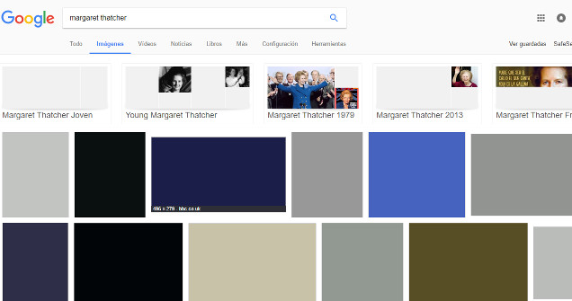

# Optimización de imágenes y análisis de estáticos

## Optimización de imágenes

Exponemos algunas buenas prácticas para optimizar los recursos visuales.

1. Elimina todas las imágenes innecesarias.
2. No uses imágenes, estas no son siempre la única solución. Algunos elementos que pueden sustituir a una imágen son:

    * Efectos CCS3 siempre que sea posible.
    * Utiliza fuentes web en vez de imágenes.

    Las dos opciones indicadas además son independientes de la resolución, viéndose nítidamente en cualquier resolución, incluido con zoom. En el caso de las fuentes web también obtendremos la posibilidad de seleccionar y buscar como texto. Mejorando la usabilidad.

3. Usa imágenes vectoriales cuando sea posible (SVG). Tienen menor peso, son escalables e independientes de la resolución.
También será necesario optimizar las imágenes vectoriales. Los editores de imágenes vectoriales suelen incluir muchos metadatos y comentarios que no son necesarios para el renderizado de la imágen. Herramientas como *svgo* nos permiten eliminar dicha carga extra.
Puesto que SVG es un formato basado en XML podemos usar la compresión GZIP para reducir el tamaño de la transferencia. En ese caso, debemos tener configurado correctemente nuestro servidor Web. 

4. Utilizar tamaños de imágenes diferentes según el dispositivo (Tailored image sizes). Un dispositivo móvil es muy posible que tenga una resolución que no justifique el servir imágenes en altas resoluciones. Procura que estas tengan el tamaño justo, no tiene sentido enviar una imágen que después se va a escalar a un tamaño menor. 

5. Optimiza las imágenes binarias.

    * Elige el formato adecuado:

    | Formato | Transparencia | Animación | Navegador 
    | --- | --- | --- | --- 
    | GIF | Sí | Sí | Todos 
    | PNG | Sí | No | Todos 
    | JPEG | No | No | Todos 
    | JPEG XR | Sí | Sí | IE 
    | WebP | Sí | Sí | Chrome, Opera, Android  

    * Renderizado progresivo de imágenes. Eso permitirá visualizar la imagen aún no estando completamente descargada. Esto es secillo de hacer desde cualquier editor de imágenes.

        1. Crear el JPG como progressive. 
        2. Crear el PNG como interlaced.

    * Árbol sencillo para decisión de formato:

    
    
    1. En el caso de los formatos con compresión con pérdida como JPG, será necesario especificar un factor de compresión. En este caso no hay un valor "bueno", dependerá de la imágen y el degradado permisible.
    2. En el caso del formato PNG podemos limitar el tamaño de la paleta de colores y generar ficheros mucho mas pequeños cuando esto sea posible.

6. Si se van a cargar muchas imágenes o están son muy pesadas, podemos mostrar un bloque sólido con el tamaño ocupado por la imágen y del color sólido mayoritario de fondo. Esta es la estrategia usada por google en su buscador de imágenes.

### Automatización para Angular 2 de la optimización de imágenes:

Para webpack podemos usar *image-webpack-loader* (https://github.com/tcoopman/image-webpack-loader) o *imagemin-webpack-plugin* (https://github.com/Klathmon/imagemin-webpack-plugin). Los dos optimizan ficheros PNG, JPEG, GIF y SVG.

## Análisis de estáticos

Nos permite revisar nuestro código para encontrar errores potenciales de ejecución. Suple la carencia de un compilador. Tenemos varias opciones, no solo para JavaScript, también podemos hacer linting de CSS. A parte de los posibles errores, podemos configurar reglas de codificación. Además, podemos configurar las herramientas de integración para evitar desplieges y commits de cosas que no cumplan con las reglas especificadas.

### Automatización para Angular 2 de análisis de estáticos

Angular 2 tiene la particularidad de prescindir de JavaScript en el desarrollo en favor de TypeScript y Dart.

#### TSLint

Es una herramienta de linting especializada en TypeScript. 

Para poder utilizarla tenemos que realizar la instalación con npm:

> npm install tslint typescript -g

Las reglas se configuran mediante un fichero de configuración *tslint.json*. Dicho fichero podemos generarlo de forma automática mediante la línea de comandos:

> tslint -i

Podemos integralo con las mas importantes herramientas de automatización de tareas, editores e IDEs. (https://palantir.github.io/tslint/usage/third-party-tools/)

##### Pros:

* Permite personalizar las reglas existentes; activar, desactivar, crear nuestras propias reglas.
* Integración con herramientas de automatización y editores e IDEs.
* Es posible desactivar las reglas desde el código mediente la adición de comentarios.

##### Contras

* Requiere un mínimo de configuración.
* En máquinas con pocos recursos puede ser algo lento. 